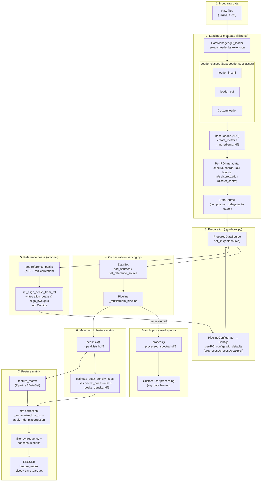

```mermaid
flowchart TD
    subgraph INPUT["1. Input: raw data"]
        RAW["Raw files<br/>(.imzML / .cdf)"]
    end

    subgraph LOAD["2. Loading & metadata (filling.py)"]
        DM["DataManager.get_loader<br/>selects loader by extension"]
        subgraph LOADERS["Loader classes (BaseLoader subclasses)"]
            L1["loader_imzml"]
            L2["loader_cdf"]
            L3["Custom loader"]
        end
        BL["BaseLoader (ABC)<br/>create_metafile<br/>→ ingredients.hdf5"]
        MD["Per-ROI metadata:<br/>spectra, coords, ROI bounds,<br/>m/z discretization (discret_coeffs)"]
        DS["DataSource<br/>(composition: delegates to loader)"]
    end

    subgraph PREP["3. Preparation (cookbook.py)"]
        PDS["PreparedDataSource<br/>set_link(datasource)"]
        CFG["PipelineConfigurator → Configs<br/>per-ROI configs with defaults<br/>(preprocess/process/peakpick)"]
    end

    subgraph DSET["4. Orchestration (serving.py)"]
        SET["DataSet<br/>add_sources / set_reference_source"]
        PIP["Pipeline<br/>_multistream_pipeline"]
    end

    subgraph REF["5. Reference peaks (optional)"]
        RP["get_reference_peaks<br/>(KDE + m/z correction)"]
        AP["set_align_peaks_from_ref<br/>writes align_peaks & align_pweights<br/>into Configs"]
    end

    subgraph MAINPATH["6. Main path to feature matrix"]
        P2["peakpick()<br/>→ peaklists.hdf5"]
        P3["estimate_peak_density_kde()<br/>uses discret_coeffs in KDE<br/>→ peaks_density.hdf5"]
    end

    subgraph BRANCH["Branch: processed spectra"]
        P1["process()<br/>→ processed_spectra.hdf5"]
        USER["Custom user processing<br/>(e.g. data binning)"]
    end

    subgraph FEAT["7. Feature matrix"]
        FM["feature_matrix<br/>(Pipeline / DataSet)"]
        KM["m/z correction:<br/>_summerize_kde_mz +<br/>apply_kde_mzcorrection"]
        FILT["filter by frequency +<br/>consensus peaks"]
        OUT["RESULT:<br/>feature_matrix<br/>pivot + save .parquet"]
    end

    RAW --> DM
    DM --> LOADERS
    LOADERS --> BL
    BL --> MD
    MD --> DS
    DS --> PDS
    CFG --> PDS
    PDS --> SET
    SET --> PIP

    %% Branch: processed spectra (separate path, not to feature matrix)
    PIP -.->|separate call| P1
    P1 --> USER

    %% Main path to feature matrix
    PIP --> P2
    P2 --> P3
    P3 --> KM
    P2 --> FM
    FM --> KM
    KM --> FILT
    FILT --> OUT

    %% Reference peaks (optional) feed align configs only
    PDS --> RP
    RP --> AP
    AP --> CFG
```